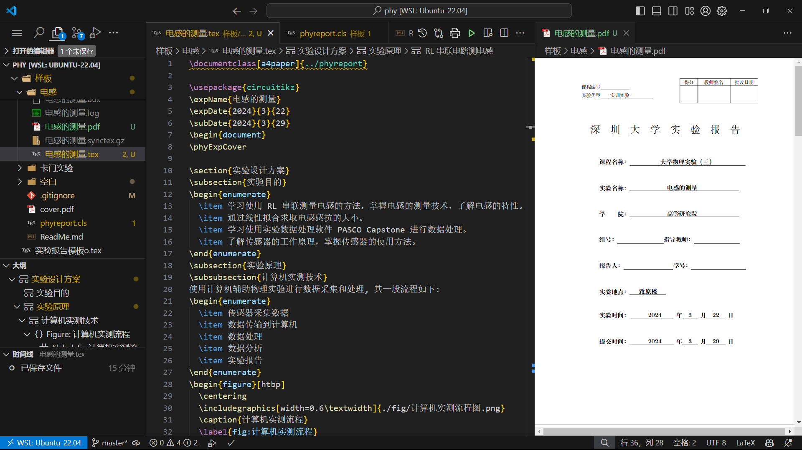

深圳大学大学物理实验报告 $\LaTeX$ 模板（
基于大学物理实验（三）要求）

> 更漂亮的字体，更好的排版，更方便的使用。
> 
> 适合上进者去练习 $\LaTeX$ 的好机会。


*结尾指出如何适应一般实验报告（物理实验一二都可以）。*

请在环境配置好的电脑上运行，调试过程在 Linux （WSL）使用 `XeLaTeX` 编译，示例使用 VSCode 文本编辑。

# 建议流程：
文档结构：
```shell
.
├──── ReadMe.md
├──── phyreport.cls
├──── 空白
│       └── 模版.tex
├──── 电感
│       ├── 电感的测量.tex
│       ├── 电感的测量.pdf
│       ├── fig
│       │    └── p1.png
│       └── data
│            └── pd.csv
└──── (cover.pdf)
```
0. **修改 `phyreport.cls` 文件，填写个人信息。**
1. 复制 `空白` 文件夹，重命名为实验文件夹。
2. 重命名 `模版.tex` 文件，编辑内容，补充实验细节。
3. 编译 `实验.tex` 文件，生成 `实验.pdf` 文件。

这样安排可以方便管理实验报告，**一个文件夹记录一次实验**,同时保留模板文件,复用好。
<!-- # 实现功能：
1. 实验报告封面 -->

# 原理说明
编写了一个 `phyreport.cls` 类文件（就像article、ctexart），定义了实验报告的格式，通过控制页边距等使得像官方提供的 Word 模版。于是每次文档直接使用这个类文件即可得到一份“普通的”实验报告。

基于 ctexart 类，预先一些常用包和需要的功能，如我们使用 `tikz` 绘制了封面以及各种打分方格。

细节说明: 
+ 使用 fancypage 和页边指令控制页边距，清除页眉页脚，让页码只在右下；
+ 改了一般的节 section 标题格式，变成汉字数字且左对齐 *这里也许可以改进得更简单*
+ 使用新命令定义变量，方便修改，如实验名称、实验地点、实验日期等；

正文使用的命令
1. `\phyExpCover` : 生成封面，里面的日期
2. **`\longLine` : 生成一条长横线，用于分隔不同部分;** *这是目前实现的最简单做法*
3. `\endBox` : 用于绘制结尾教师评价和打分表格。

# 修改配置
- 进入 `phyreport.cls` 文件，修改 `\NewDocumentCommand\phyExpCover{}` 内容，填上你的课程编号、学院、老师、名字、学号、组号等不会变的信息。
- [ 可选 ] 填写每次实验地点：取消注释 l.38-41 l.72,同时注释l.73 ,使之变成
    ```latex
    \newcommand{\expAddr}[1]{
        \IfValueTF{#1}{\newcommand{\phyExpAddr}{#1}}
                      {\newcommand{\phyExpAddr}{致原楼}}
    }
    ...
    ...
    ...
    \node[above] at (5.75,-16.3){\phyExpAddr};
    % \node[above] at (5.75,-16.3){致原楼};
    ```
    **但是这样每次得需要写上 `\phyExpAddr{}` 否则编译报错.**
- [ 特殊 ] 使用 pdf 作为封面在pdf添加相应信息: 在 `phyreport.cls` 文件中的 `\NewDocumentCommand\phyExpCover{}` 中的 `\begin{tikzpicture}` 之后，直接插入封面图片。
    ```latex
    \node at (current page.center) 
    {
        \includegraphics[width=\paperwidth, height=\paperheight, keepaspectratio=false]{../cover.pdf};
    };
    ```
    可参考 `卡门实验` 文件.其中使用了 `cover.pdf` 和自定义的 `phyreport.cls` 文件,。

^ 这个可以方便实验（一/二）


# 其它
- 同一目录操作:
     ```latex
    \documentclass[a4paper]{../phyreport}
    ```
    `../` 代表上一级目录，可以直接在`实验`文件夹中使用上一级`样版`中`phyreport.cls` 文件。如果不习惯,可以将 `phyreport.cls` 文件相应 .tex 同文件夹下。
- 两处字体大小不合适,会提示难以适配,不影响整体.
- 本模板为学习交流使用，不保证完全符合实验报告要求。
- **不完美之处**：有时最好删掉 `longLine` 自己调整格式,使得看起来更协调
- 最大优势: ~~方便抄+Copolit自动补全公式总结~~
- 加入样板的实验报告:
    1. 卡门实验
    2. 电感测量


没有 Q&A，架构简单，请自由探索。